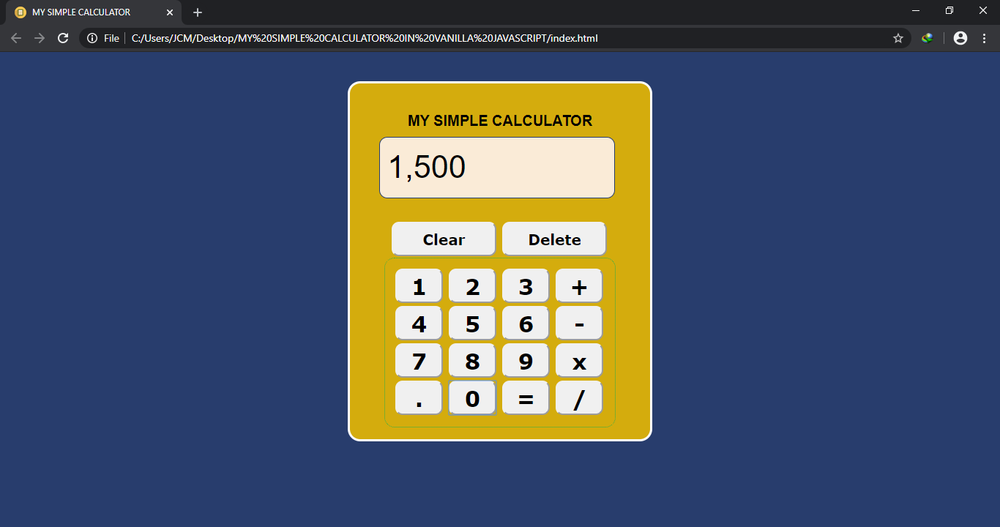

# MY SIMPLE CALCULATOR IN VANILLA JAVASCRIPT

* Purpose: My Project
* Front End: HTML5, CSS3, Vanilla JavaScript
* Responsive Web Design: No
* Type of Website: Dynamic

<h2> User Interface Screenshots </h2> 
  
    